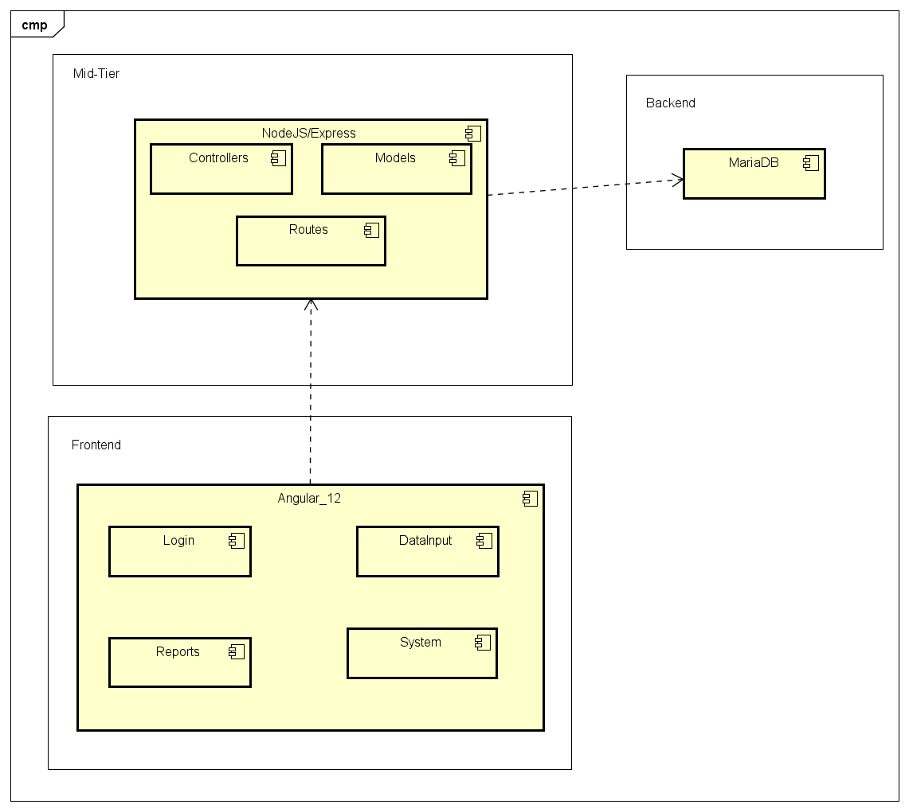
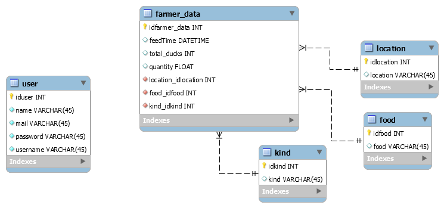

# feed-time-frontend

## Overview

Backend/Mid-Tier responsible for the project Feed-Time, presented to study on how Ducks are feed on parks arround the world.

To Backend/Mid-Tier information visit the Backend repository on:

## [feed-time-backend](https://github.com/fgguilherme/feed-time-backend)

## Tech Stacks

- Backend - MySQL - Relational DB
- Mid-Tier - Node + Express + JWT
- Frontend - Angular 12

### Why?

On Databese, MySQL was chosen instead of Mongo by the data format, stable on shape and fields. However, Mongo could also do the job regarding the amount of data in case of success of the platform.
Mid-Tier was set by its simplicity over Python, that should be selected instead in case of complex calculations/analysis.
The Frontend was made on Angular and Bootstrap, reducing the CSS work, giving an organized file tree.

## System Components

1) Backend:
   * MySQL database, simple and easy to use, in case of change to another DB, refactory on Models are needed.
2) Mid-Tier:
   * Routes - responsible to provide main routes:
     * /api/v1/food - GET/POST - Food given to Ducks.
     * /api/v1/foodkind - GET/POST - Kind of Food given to Ducks.
     * /api/v1/location - GET/POST - Locations the Ducks are feed.
     * /api/v1/feederdata - GET/POST - Get all entrys on DB, Post a single entry.
     * /api/v1/feederdatas - POST - Post multiple entrys at same time.
     * /api/v1/login - POST - Login. - Not implemented - JWT
   * Controllers - Responsible to parse data from Frontend to Backend, parsing, converting unities, etc.
   * Models - Communicates with database to provide its abstraction, giving more freedom to Controller.
3) Frontend:
   * Data Input - responsible to data acquisition, planned for older people, with minimum of Keyboard needed, possibilities to add new Food, Kind of Food or Location on the go. At the Calendar, the user can select a single date or a range of dates. Should be good implement a list of single dates/ranges at same calendar to give user more freedom to submit data information.
   * Reports - A Table with all data stored, working with filters, sorting and pagination. Will be added an Export function
   * System - Not Implemented - Configurations and user management
   * Login - Not Implemented - Should be used to access Reports

## DB Models

## Install dependencies

* Node (used 14.15.1)
* npm (used 6.14.18)
* Apache

## Install process

1) Visit [feed-time-backend](https://github.com/fgguilherme/feed-time-backend) and make shure to have a backend running.
2) Update config files under `src/environment` folder
   * environment:
     * api -> base addres to API, ending on `v1/`
3) run `npm install`

##  Run

You can run locally, 
* to debug running the command:
`npm start`
* to deploy running the command:
`ng build "--configuration" "production" "--aot"` and copy ./dist folder to Apache serving folder.

## 10H Commit

The 10H commit is described at the TAG 10H 

Total hours spent on this project: 12H:
- 10H Frontend
- 02H Backend

## @Todo

- [ ] Login to use Reports
- [ ] User Management
- [ ] Docker Deploy
- [ ] New languages on i18n
- [ ] Export Report
- [ ] Graphs to improve reports
- [ ] Pagination on Backend - need changes on Front to follow the back structure.
